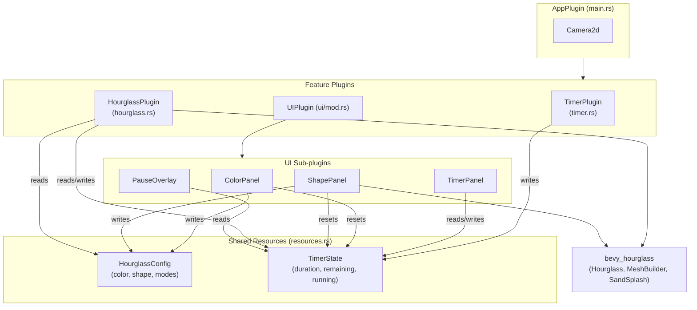

<!-- wiki:sources: src/main.rs, src/resources.rs, src/timer.rs, src/hourglass.rs, src/ui/mod.rs, Cargo.toml -->

# Architecture Overview

## System Context

Hourglass Timer is a single-screen desktop/web application built on the [Bevy](https://bevyengine.org/) game engine (v0.16, an ECS framework). It renders an interactive countdown as a visual hourglass via the [`bevy_hourglass`](https://crates.io/crates/bevy_hourglass) crate. The same source compiles to a **native** binary and to **WebAssembly** ([[features/web-build]]); the live deployment is the WASM build. There is no backend, no persistence, and no networking — it is entirely client-side.

## Component Diagram

## Targets / Build Artifacts

- **Native** — `cargo run` / `cargo build`, default `dev_native` feature (dynamic linking, hot reload, Wayland). Release uses thin LTO.
- **Web (WASM)** — `./build_wasm.sh` → `cargo build --target wasm32-unknown-unknown --no-default-features` + `wasm-bindgen`, output to `wasm/`. Minimal Bevy feature set + `getrandom` js backend. See [[features/web-build]].

## Component Map

| Component | Directory / File | Responsibility |
|-----------|------------------|---------------|
| [[modules/app]] | [[src/main.rs\|src/main.rs]] | Plugin composition, camera. |
| [[modules/resources]] | [[src/resources.rs\|src/resources.rs]] | The two shared resources + enums. |
| [[modules/timer]] | [[src/timer.rs\|src/timer.rs]] | Countdown logic. |
| [[modules/hourglass]] | [[src/hourglass.rs\|src/hourglass.rs]] | Hourglass rendering, shapes, morphing, input. |
| [[modules/ui-layout]] | [[src/ui/mod.rs\|src/ui/mod.rs]] | Flexbox scaffold, markers, panel visibility resource. |
| [[modules/color-panel]] | [[src/ui/color_panel.rs\|src/ui/color_panel.rs]] | Color controls. |
| [[modules/shape-panel]] | [[src/ui/shape_panel.rs\|src/ui/shape_panel.rs]] | Shape + morph controls. |
| [[modules/timer-panel]] | [[src/ui/timer_panel.rs\|src/ui/timer_panel.rs]] | Duration + playback controls. |
| [[modules/pause-overlay]] | [[src/ui/pause_overlay.rs\|src/ui/pause_overlay.rs]] | "PAUSED" banner. |

## Key Design Decisions

- **Resource-mediated, plugin-decoupled architecture** — plugins never call each other; they communicate only by reading/writing the `HourglassConfig` and `TimerState` resources. This is idiomatic Bevy ECS and keeps each plugin independently understandable. Supports every feature. See [[patterns#Resource-mediated communication]].
- **Logic/visual split for the timer** — the countdown ([[modules/timer]]) mutates only state; a separate system mirrors state into the `Hourglass` ([[modules/hourglass]]). Enables [[features/countdown-timer]] to be unit-tested. See [[flows/countdown-tick]].
- **Recreate-on-change rendering** — shape/color changes despawn and rebuild the hourglass because `bevy_hourglass` builds meshes from config. Drives [[features/shape-selection]], [[features/shape-morphing]], [[features/color-selection]]. See [[flows/appearance-recreation]] and [[patterns#Recreate-on-change rendering]].
- **Pure helpers extracted from systems** — arithmetic-heavy logic is pulled into free functions so it's testable without a Bevy `App`. See [[references/test-coverage]] and [[patterns#Pure helpers extracted from systems]].
- **Dual UI model** — Bevy UI nodes for the color row / timer panel; world-space sprites for the shape selectors (so they can be real mini-hourglasses). See [[patterns#Dual UI: nodes vs. world sprites]].
- **One codebase, two feature sets** — native vs. web differ only in `Cargo.toml` feature selection, not in app code. See [[features/web-build]].

## External Dependencies

| Dependency | Role |
|------------|------|
| `bevy` 0.16 | ECS, windowing, rendering, UI, input. |
| `bevy_hourglass` 0.2.2 | The hourglass mesh, sand simulation, flip animation, sand-splash particles. |
| `rand` 0.8 | Random color/shape selection. |
| `approx` (dev) | Float comparisons in tests. |
| `getrandom` (wasm) | Browser entropy for `rand` on WASM. |

## Related Pages

- [[HOME]], [[patterns]], [[features/overview]]
- [[flows/startup]], [[flows/countdown-tick]], [[flows/appearance-recreation]], [[flows/click-vs-drag]]
