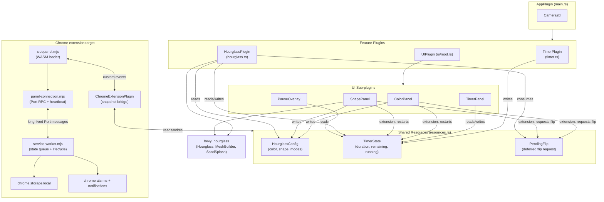

<!-- wiki:sources: src/main.rs, src/resources.rs, src/timer.rs, src/hourglass.rs, src/ui/mod.rs, src/chrome_extension.rs, extension/panel-connection.mjs, extension/sidepanel.mjs, extension/service-worker.mjs, extension/state.mjs, Cargo.toml -->

# Architecture Overview

## System Context

Hourglass Timer is a single-screen application built on the [Bevy](https://bevyengine.org/) game engine (v0.16, an ECS framework). It renders an interactive countdown as a visual hourglass via the [`bevy_hourglass`](https://crates.io/crates/bevy_hourglass) crate. The same source compiles to a **native** binary, an ordinary **WebAssembly** site ([[features/web-build]]), and a Manifest V3 **Chrome Side Panel extension**. There is no remote backend or host-page access. The extension adds a local service worker, `chrome.storage`, and Chrome alarms for synchronization while panels are open; closing the last panel clears that state so the next session starts from the three-minute default.

## Component Diagram

## Targets / Build Artifacts

- **Native** — `cargo run` / `cargo build`, default `dev_native` feature (dynamic linking, hot reload, Wayland). Release uses thin LTO.
- **Web (WASM)** — `./build_wasm.sh` → `cargo build --target wasm32-unknown-unknown --no-default-features` + `wasm-bindgen`, output to `wasm/`. Minimal Bevy feature set + `getrandom` js backend. See [[features/web-build]].
- **Chrome extension (WASM)** — `./build_extension.sh` builds with `--features chrome_extension`, runs `wasm-bindgen`/`wasm-opt`, and packages the local WASM, JavaScript, manifest, service worker, and icons in `dist/chrome-extension/` plus a ZIP.

## Component Map

| Component | Directory / File | Responsibility |
|-----------|------------------|---------------|
| [[modules/app]] | [[src/main.rs\|src/main.rs]] | Plugin composition, camera. |
| [[modules/resources]] | [[src/resources.rs\|src/resources.rs]] | The two shared resources + enums. |
| [[modules/timer]] | [[src/timer.rs\|src/timer.rs]] | Countdown logic. |
| [[modules/hourglass]] | [[src/hourglass.rs\|src/hourglass.rs]] | Hourglass rendering, shapes, morphing, input. |
| [[modules/ui-layout]] | [[src/ui/mod.rs\|src/ui/mod.rs]] | Flexbox scaffold, markers, panel visibility resource. |
| [[modules/color-panel]] | [[src/ui/color_panel.rs\|src/ui/color_panel.rs]] | Color controls. |
| [[modules/shape-panel]] | [[src/ui/shape_panel.rs\|src/ui/shape_panel.rs]] | Shape + morph controls. |
| [[modules/timer-panel]] | [[src/ui/timer_panel.rs\|src/ui/timer_panel.rs]] | Duration + playback controls. |
| [[modules/pause-overlay]] | [[src/ui/pause_overlay.rs\|src/ui/pause_overlay.rs]] | "PAUSED" banner. |
| Extension bridge | [[src/chrome_extension.rs\|src/chrome_extension.rs]] | Versioned snapshots, wall-clock deadlines, and Bevy/JavaScript events. |
| Side-panel loader | `extension/sidepanel.mjs` | Restores state before Bevy starts and synchronizes panel changes. |
| Panel connection | `extension/panel-connection.mjs` | Sends state RPCs and periodic heartbeats over a reconnecting long-lived Port. |
| Extension worker | `extension/service-worker.mjs` | Serializes state changes, owns alarms/notifications, tracks live panels, and clears state after the last close. |

## Key Design Decisions

- **Resource-mediated, plugin-decoupled architecture** — plugins never call each other; they communicate only by reading/writing the `HourglassConfig` and `TimerState` resources. This is idiomatic Bevy ECS and keeps each plugin independently understandable. Supports every feature. See [[patterns#Resource-mediated communication]].
- **Logic/visual split for the timer** — the countdown ([[modules/timer]]) mutates only state; a separate system mirrors state into the `Hourglass` ([[modules/hourglass]]). Enables [[features/countdown-timer]] to be unit-tested. See [[flows/countdown-tick]].
- **Recreate-on-change rendering** — shape/color changes despawn and rebuild the hourglass because `bevy_hourglass` builds meshes from config. Drives [[features/shape-selection]], [[features/shape-morphing]], [[features/color-selection]]. See [[flows/appearance-recreation]] and [[patterns#Recreate-on-change rendering]].
- **Extension-only appearance restart/flip** — Chrome side-panel color and shape choices restart the timer and set a one-shot `PendingFlip` that `apply_pending_flip` applies to the rebuilt entity next frame. Native and ordinary web targets retain their original appearance-only behavior.
- **Pure helpers extracted from systems** — arithmetic-heavy logic is pulled into free functions so it's testable without a Bevy `App`. See [[references/test-coverage]] and [[patterns#Pure helpers extracted from systems]].
- **Dual UI model** — Bevy UI nodes for the color row / timer panel; world-space sprites for the shape selectors (so they can be real mini-hourglasses). See [[patterns#Dual UI: nodes vs. world sprites]].
- **One codebase, three targets** — native and ordinary web share the default application behavior; `chrome_extension` adds responsive sidebar layout, lifecycle synchronization, and extension-only appearance semantics.
- **Live-panel Port protocol** — each side panel sends state requests and 20-second heartbeats over a long-lived runtime Port. This keeps Manifest V3 worker bookkeeping alive while the panel is open and reconnects the panel if Chrome replaces the worker.

## External Dependencies

| Dependency | Role |
|------------|------|
| `bevy` 0.16 | ECS, windowing, rendering, UI, input. |
| `bevy_hourglass` 0.2.2 | The hourglass mesh, sand simulation, flip animation, sand-splash particles. |
| `rand` 0.8 | Random color/shape selection. |
| `approx` (dev) | Float comparisons in tests. |
| `getrandom` (wasm) | Browser entropy for `rand` on WASM. |
| `serde` / `serde_json` (extension) | Versioned state snapshots shared with JavaScript. |
| `wasm-bindgen`, `js-sys`, `web-sys` (extension) | Browser custom-event and wall-clock bridge. |

## Related Pages

- [[HOME]], [[patterns]], [[features/overview]]
- [[flows/startup]], [[flows/countdown-tick]], [[flows/appearance-recreation]], [[flows/click-vs-drag]]
