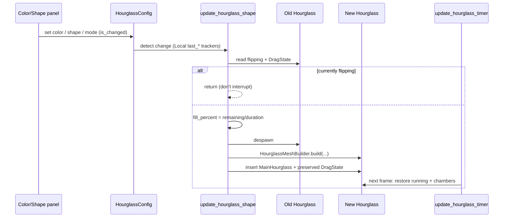
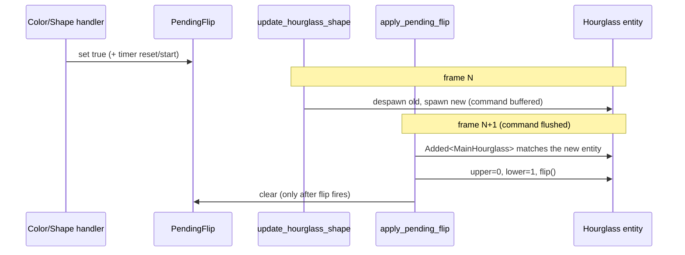

<!-- wiki:sources: src/hourglass.rs, src/ui/color_panel.rs, src/ui/shape_panel.rs, src/resources.rs -->

# Flow: Appearance Recreation

## Purpose

How a color or shape change becomes a visibly-updated hourglass. This is the project's signature mechanism: because `bevy_hourglass` builds its mesh from config and can't restyle in place, most appearance changes **despawn the hourglass and build a new one**, carefully preserving timer/drag state.

Supports: [[features/color-selection]], [[features/shape-selection]], [[features/shape-morphing]].

## Entry Points

- `update_hourglass_color` — in-place color (sand + particles).
- `update_hourglass_shape` — rebuild on shape/mode/static-color change (Static shape mode).
- `update_morphing_shape` — rebuild each tick (Morphing mode).
- `apply_pending_flip` — flips the rebuilt entity when a color/shape change requested it (ordered *before* the two rebuild systems).

All in [[src/hourglass.rs|hourglass.rs]] (`Update`).

## Sequence Diagram

## Decision logic in `update_hourglass_shape`

Active only in `ShapeMode::Static`. It keeps four `Local` trackers (`last_shape_type`, `last_shape_mode`, `last_color_mode`, `last_recreation_time`) and decides:

| Condition | Action |
|-----------|--------|
| shape, shape-mode, or color-mode changed | rebuild immediately |
| config changed, `ColorMode::Rainbow` | rebuild, but **throttled** (~0.01 s) to keep particles visible |
| config changed, `ColorMode::Static` | rebuild (so the sand *body* updates, not just particles) |
| nothing changed | return early |

Then, before rebuilding: read the old entity's `flipping` + `DragState`; **if flipping, return** (never interrupt a flip); else despawn, compute `fill_percent = remaining/duration`, build via `HourglassMeshBuilder` (body + plates + sand + sand-splash + timing), and re-insert `MainHourglass` + the preserved `DragState`. State is restored next frame by `update_hourglass_timer`.

`update_morphing_shape` follows the identical preserve→guard→despawn→rebuild recipe, but is driven by time (`t = elapsed % 8 / 8`) rather than a config change, and feeds an interpolated config from `get_morphed_shape_config`.

## Why two systems touch color

`update_hourglass_color` updates `sand_color` and particle color **in place** every change — cheap, but it does *not* refresh the sand body mesh. The static-color rebuild in `update_hourglass_shape` exists precisely to fix that gap (documented in [[TESTING.md|TESTING.md]]: "only sand particles would change color but the main sand body would remain the old color"). So a static color change triggers both: the in-place update *and* a rebuild.

## Flipping the rebuilt hourglass

A color or shape change doesn't only rebuild the hourglass — it also **flips** it, so the sand resets to the top to match the restarted countdown. The flip can't be issued at the click site: the rebuild despawns the current entity, and a flip applied to that doomed entity (a) is lost when it's despawned and (b) sets its `flipping` flag, which the rebuild guard reads as "don't interrupt a flip" — silently dropping the whole color/shape change. So the flip is deferred onto the *new* entity via a one-shot resource, [[modules/resources#PendingFlip|`PendingFlip`]].

Three moving parts make this safe:

- **`apply_pending_flip`** queries `Query<&mut Hourglass, (With<MainHourglass>, Added<MainHourglass>)>` — `Added` only matches the entity the frame *after* its spawn command flushes, so the flip lands on the rebuilt hourglass, never the old one. It mirrors the drag-flip: set `upper_chamber = 0.0` / `lower_chamber = 1.0` before `flip()` so the crate's end-of-flip chamber swap leaves the top full.
- **Clear-on-fire** — `PendingFlip` is reset to `false` only once the flip actually fires (gated by `can_flip()`), so a request made while a previous flip was still blocking the rebuild survives to the real respawn.
- **First-start suppression** — `handle_timer_start` skips its own first-start flip whenever `PendingFlip` is set, because the color/shape change also starts the timer; without this it would flip the old entity and trip the rebuild guard. See [[modules/hourglass#Flip-on-change orchestration]].

## Important Files

| File | Role in Flow |
|------|-------------|
| [[src/hourglass.rs\|hourglass.rs]] | The three update systems + `apply_pending_flip` + `HourglassMeshBuilder` calls. |
| [[src/resources.rs\|resources.rs]] | `PendingFlip` — the deferred-flip signal. |
| [[src/ui/color_panel.rs\|color_panel.rs]], [[src/ui/shape_panel.rs\|shape_panel.rs]] | Write the config + set `PendingFlip` to trigger recreation and flip. |

## Data and State

The hourglass entity is transient — it may be destroyed and rebuilt many times per second (morphing). Durable state lives in `TimerState` + `HourglassConfig` (resources) and the preserved `DragState`; the entity is just a view of them.

## Error Paths

- **Mid-flip change** — deferred (system returns) until the flip animation completes.
- **`duration == 0`** — `fill_percent` falls back to `1.0`.

## Related Pages

- [[patterns#Recreate-on-change rendering]]
- [[modules/hourglass]]
- [[features/color-selection]], [[features/shape-selection]], [[features/shape-morphing]]
