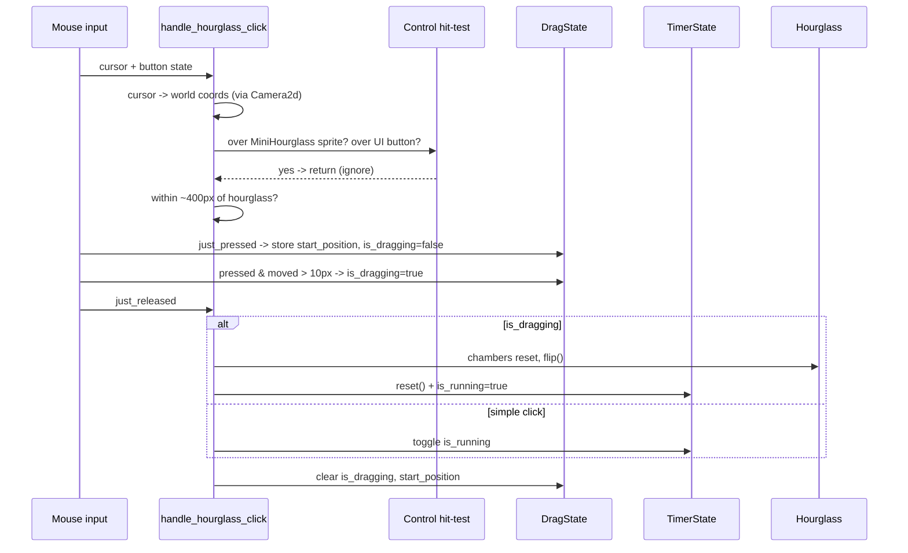

<!-- wiki:sources: src/hourglass.rs, src/ui/shape_panel.rs -->

# Flow: Click vs. Drag

## Purpose

How a single left-button interaction on the hourglass is resolved into either a **click** (toggle pause/play) or a **drag** (flip + reset), and how clicks on overlapping controls are excluded.

Supports: [[features/hourglass-interaction]].

## Entry Points

`handle_hourglass_click` in [[src/hourglass.rs|hourglass.rs]] (`Update`).

## Sequence Diagram

## Step-by-Step Execution

1. **Cursor → world** — [[src/hourglass.rs|hourglass.rs]]`:handle_hourglass_click`: reads the window cursor and projects it through the `Camera2d` with `viewport_to_world_2d`.
2. **Control exclusion** — bail out if the cursor is over a [[modules/shape-panel|`MiniHourglass`]] sprite (distance < `30 * scale`) or over any Bevy UI button (`Interaction != Interaction::None`). This is what stops shape/color selection from also toggling the timer.
3. **Bounds check** — proceed only if within ~400 px of the hourglass center.
4. **Press** (`just_pressed`) — record `start_position`, set `is_dragging = false`.
5. **Move while pressed** — if cursor moved more than `drag_threshold` (10 px), set `is_dragging = true`.
6. **Release** (`just_released`):
   - **Drag** → if `hourglass.can_flip()`: snap chambers to all-sand-in-bottom, call `flip()`, `timer_state.reset()`, then `is_running = true`.
   - **Click** → toggle `timer_state.is_running`.
7. **Cleanup** — clear `is_dragging` and `start_position`.

Separately, [[modules/hourglass#handle_timer_start|`handle_timer_start`]] watches for the not-running→running edge and flips the hourglass **only on the very first start**, so a plain click-to-resume doesn't re-flip — and it skips even that flip when a color/shape change has queued one via `PendingFlip` (see [[modules/hourglass#Flip-on-change orchestration]]).

## Important Files

| File | Role in Flow |
|------|-------------|
| [[src/hourglass.rs\|hourglass.rs]] | `handle_hourglass_click`, `DragState`, `handle_timer_start`. |
| [[src/ui/shape_panel.rs\|shape_panel.rs]] | Defines `MiniHourglass` (the sprites excluded in step 2). |

## Data and State

`DragState` (per-entity component on the main hourglass) holds the in-flight gesture; `TimerState` is the durable outcome. The drag threshold (10 px) is the single tunable separating intents.

## Error Paths

- **No window / no cursor / projection fails** — the nested `if let Ok(...)` chain simply does nothing that frame.
- **Flip while already flipping** — guarded by `hourglass.can_flip()`.

## Related Pages

- [[features/hourglass-interaction]]
- [[modules/hourglass]], [[modules/shape-panel]]
