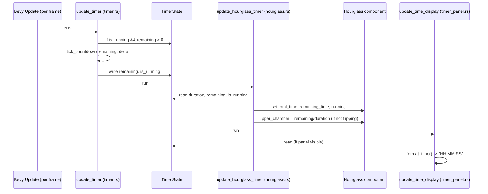

<!-- wiki:sources: src/timer.rs, src/hourglass.rs, src/ui/timer_panel.rs, src/resources.rs -->

# Flow: Countdown Tick

## Purpose

What happens every frame while the timer runs: the countdown decrements, the hourglass sand level follows, and the time display refreshes. Shows the deliberate split between the *logic* (timer module) and the *visual* (hourglass module).

Supports: [[features/countdown-timer]].

## Entry Points

`update_timer` in [[src/timer.rs|timer.rs]] (`Update` schedule).

## Sequence Diagram

## Step-by-Step Execution

1. **Decrement** — [[src/timer.rs|timer.rs]]`:update_timer`: if running and time remains, call the pure `tick_countdown(remaining, delta_secs)`. It returns `(0.0, false)` on overshoot/zero, else `(new_remaining, true)`. Writes both back to `TimerState`.
2. **Mirror into the visual** — [[src/hourglass.rs|hourglass.rs]]`:update_hourglass_timer`: copies `TimerState` into the `Hourglass` component and sets `upper_chamber = remaining/duration`, `lower_chamber = 1 - that` — but only when `duration > 0` and the hourglass isn't mid-flip. This system is ordered `.after(update_morphing_shape)` so a freshly-rebuilt (morphed) hourglass gets its state restored the same frame.
3. **Refresh display** — [[src/ui/timer_panel.rs|timer_panel.rs]]`:update_time_display`: if the panel is visible, set the `TimeDisplay` text to `timer_state.format_time()`.

## Data and State

The whole flow is mediated by the `TimerState` resource — `update_timer` is its only writer here, and the other two systems are read-only consumers. This one-writer/many-readers shape is the project's core decoupling. See [[patterns#Resource-mediated communication]].

## Error Paths

- **Overshoot** (a large `delta`, e.g. after a stall) can't produce negative time — `tick_countdown` clamps to 0 and stops the timer.
- **`duration == 0`** — `update_hourglass_timer` skips the chamber math (avoids divide-by-zero); `update_hourglass_shape`/`update_morphing_shape` fall back to `fill_percent = 1.0`.

## Related Pages

- [[modules/timer]], [[modules/hourglass]]
- [[features/countdown-timer]]
