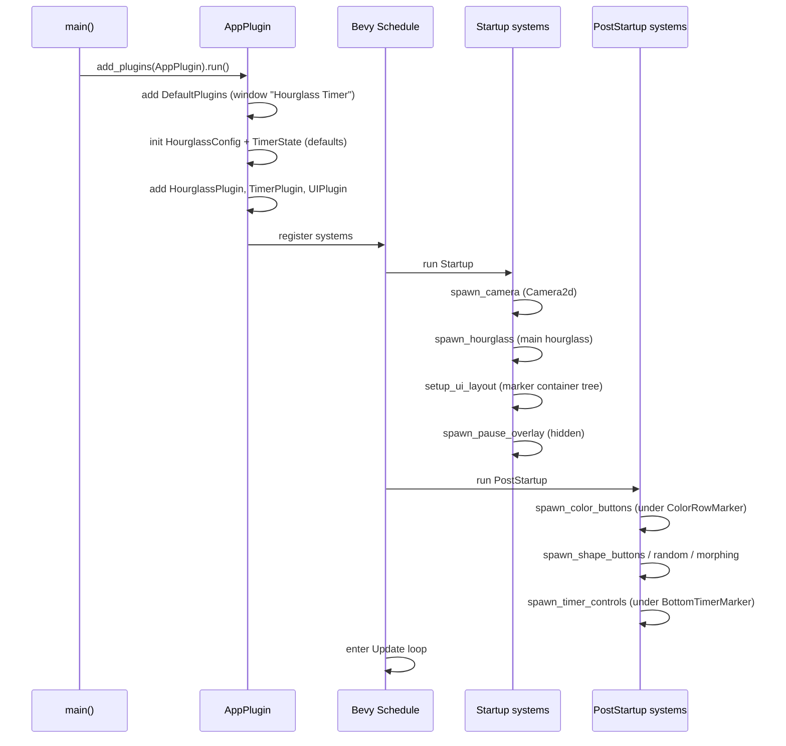

<!-- wiki:sources: src/main.rs, src/hourglass.rs, src/ui/mod.rs, src/ui/color_panel.rs, src/ui/shape_panel.rs, src/ui/timer_panel.rs, src/ui/pause_overlay.rs -->

# Flow: Startup

## Purpose

How the app goes from `main()` to a fully-built, interactive screen. Understanding the `Startup` vs. `PostStartup` split here explains why the UI panels reliably find their containers.

Supports: all features (it's the bootstrap).

## Entry Points

`main()` → `AppPlugin::build` in [[src/main.rs|main.rs]].

## Sequence Diagram

## Step-by-Step Execution

1. **`main()`** — [[src/main.rs|main.rs]]`:main`: builds the `App`, adds `AppPlugin`, runs. Returns `AppExit`.
2. **Plugin assembly** — `AppPlugin::build`: adds `DefaultPlugins` (custom window title + `fit_canvas_to_parent`), inits the two resources from their `Default` impls, adds the three feature plugins, registers `spawn_camera` on `Startup`.
3. **`Startup`** runs (order within a schedule is unspecified unless constrained, but these are independent):
   - `spawn_camera` — the single `Camera2d`.
   - `spawn_hourglass` ([[modules/hourglass]]) — builds the main hourglass from default config/timer.
   - `setup_ui_layout` ([[modules/ui-layout]]) — the flexbox marker tree (`ColorRowMarker`, `ShapeRowMarker`, `BottomTimerMarker`).
   - `spawn_pause_overlay` ([[modules/pause-overlay]]) — hidden overlay.
4. **`PostStartup`** runs — the panel spawners attach buttons to the markers created in step 3. Running here (not `Startup`) guarantees the containers already exist. See [[code-index/entry-points#Why PostStartup for the panels]].
5. **`Update`** loop begins — countdown, input, rendering-sync, animation systems run every frame.

## Important Files

| File | Role in Flow |
|------|-------------|
| [[src/main.rs\|main.rs]] | Plugin assembly + camera. |
| [[src/ui/mod.rs\|ui/mod.rs]] | Marker container tree. |
| [[src/hourglass.rs\|hourglass.rs]] | Initial hourglass. |
| [[src/ui/color_panel.rs\|color_panel.rs]], [[src/ui/shape_panel.rs\|shape_panel.rs]], [[src/ui/timer_panel.rs\|timer_panel.rs]] | `PostStartup` button spawners. |

## Data and State

`HourglassConfig` and `TimerState` are created from their `Default`s (sandy Classic; 3 min, paused). No persistence — every launch starts fresh.

## Related Pages

- [[architecture/overview]]
- [[code-index/entry-points]]
- [[flows/countdown-tick]]
