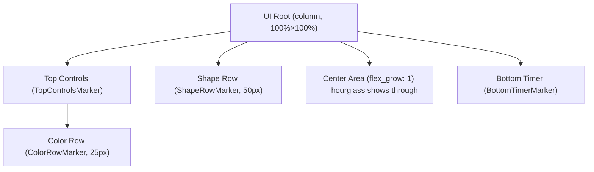

<!-- wiki:sources: src/ui/mod.rs -->

# UI Layout (Scaffold)

## Responsibility

The UI composition root. `UIPlugin` nests the four UI sub-plugins and runs `setup_ui_layout`, which builds the flexbox skeleton of marker nodes the panels attach their buttons to. It also owns the `TimerPanelVisible` resource that toggles the timer panel.

## Where It Lives

[[src/ui/mod.rs|src/ui/mod.rs]]

## Public Interfaces

### Marker components

These empty marker components tag the container nodes so sub-plugins can find them with a `Query`:

| Marker | Tags | Queried by |
|--------|------|-----------|
| `TopControlsMarker` | The top controls column | (layout only) |
| `ColorRowMarker` | The color swatch row | [[modules/color-panel]] |
| `ShapeRowMarker` | The shape selector row | [[modules/shape-panel]] (for positioning) |
| `BottomTimerMarker` | The bottom timer container | [[modules/timer-panel]] |

### TimerPanelVisible

```rust
#[derive(Resource, Default)]
pub struct TimerPanelVisible(pub bool);
```

A boolean resource (default `false` = hidden). [[modules/timer-panel]] toggles it on the "Timer Controls" button and reacts to it to show/hide the controls.

## Layout structure

`setup_ui_layout` spawns one root `Node` (100% × 100%, column flex, transparent) with four children, top to bottom:



The **Center Area** uses `flex_grow: 1.0` and a transparent background; it occupies the middle of the screen but holds no UI — the world-space hourglass (rendered by the same camera) shows through it. The color/shape rows pin to the top, the timer controls to the bottom.

## A note on two UI systems coexisting

This app mixes **Bevy UI nodes** (the color row + timer panel — laid out by flexbox, interacted via `Interaction`) and **world-space sprites** (the mini-hourglass shape buttons in [[modules/shape-panel]] — positioned in world coords, hit-tested by distance). The shape row marker here is used by [[modules/shape-panel]] only to *locate where to position* its world-space sprites, not to parent them. See [[patterns#Dual UI: nodes vs. world sprites]].

## Features Supported

This module is infrastructure for all UI features; it doesn't implement one itself. It enables [[features/color-selection]], [[features/shape-selection]], [[features/timer-duration-controls]].

## Dependencies

- `bevy` — `Node`, flexbox layout, `Resource`.
- Sub-plugins: [[modules/color-panel]], [[modules/timer-panel]], [[modules/shape-panel]], [[modules/pause-overlay]].

## Used By

[[modules/app]] adds `UIPlugin`. The marker components are imported by the panel modules.

## Tests

No unit tests — this is declarative layout. See [[references/test-coverage]].

## Related Pages

- [[architecture/overview]]
- [[flows/startup]]
